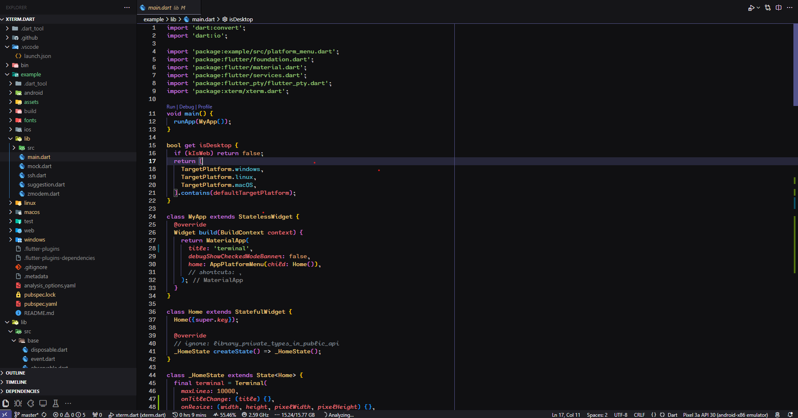
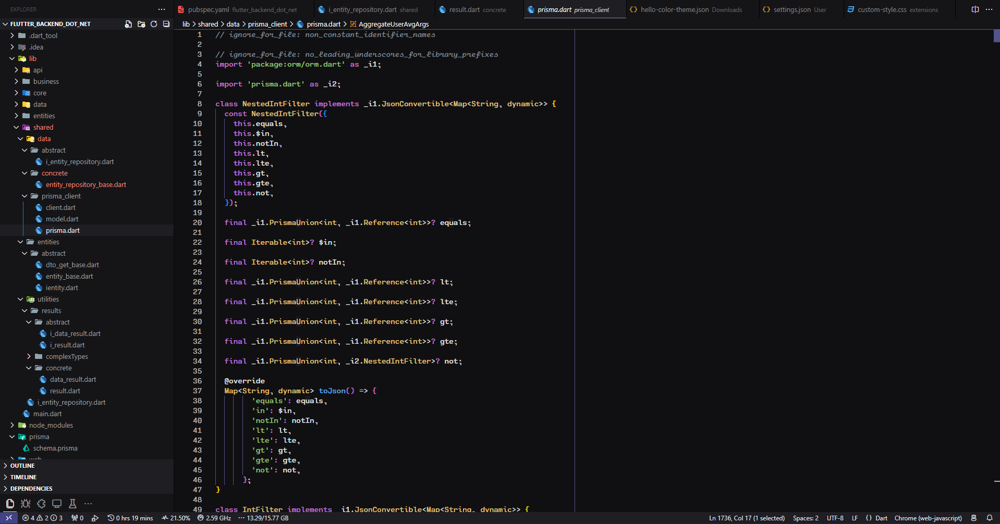

# TheBear Theme for Visual Studio Code

<p align="center">
  
  
</p>

TheBear Theme is a sleek and minimalist theme for Visual Studio Code, designed to enhance your coding experience with clean visuals and a modern aesthetic. 

## Features

- **Clean Design**: A minimalist approach to keep your workspace distraction-free.
- **Color Palette**: Shades of blue, grey, and white for a professional look.
- **Syntax Highlighting**: Enhanced readability with subtle yet distinct syntax highlighting.
- **Customizable**: Easily tweak the theme to fit your personal preferences.

## Installation

1. Open **Visual Studio Code**.
2. Go to the **Extensions** view by clicking on the square icon in the sidebar or pressing `Ctrl+Shift+X`.
3. Search for `TheBear Theme`.
4. Click **Install**.

## Activation

1. After installation, open the **Command Palette** with `Ctrl+Shift+P`.
2. Type `Preferences: Color Theme` and select `TheBear Theme` from the list.

## Customization

To customize the theme:

1. Open the **Command Palette** with `Ctrl+Shift+P`.
2. Type `Preferences: Open Settings (JSON)`.
3. Add your custom settings, for example:
    ```json
    "workbench.colorCustomizations": {
        "editor.background": "#1e1e1e",
        "editor.foreground": "#d4d4d4"
    }
    ```

## Feedback

We welcome your feedback and suggestions! If you encounter any issues or have ideas for improvements, please open an issue on our [GitHub repository](https://github.com/your-repo/memotheme).

## License

This project is licensed under the MIT License - see the [LICENSE](./Licence) file for details.

---

Thank you for choosing TheBear Theme! Happy coding!
